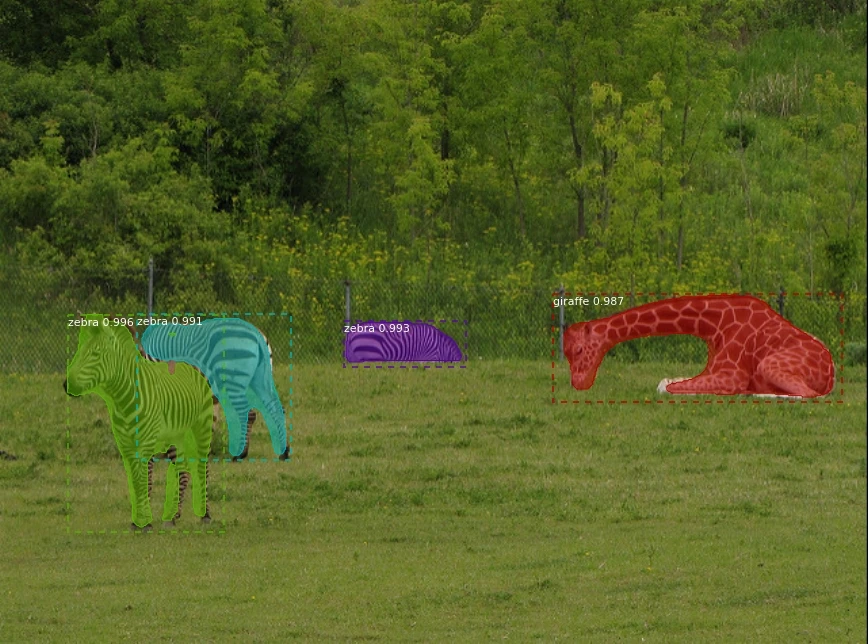

# Questions
## 1) Question -1 Read and Display open 
- perform image 
- resizing opencv
- convert a colored image into grayscale
- aafine , scaling , rotation, euclidien and similarity transformations
- frames from the video

answer : filename `q1.py`

```bash
$ pip install --upgrade opencv-python
```

## 2) Question - 2 Object Detection using R-CNN pretrained
Train an R-CNN stop sign object detector using a CNN network trained with CIFAR-10 data.



